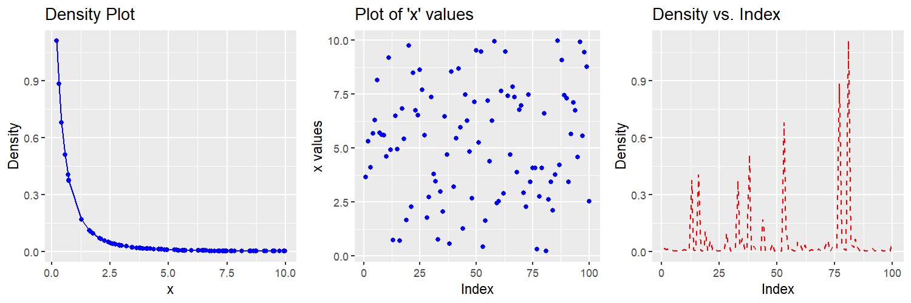

Used ***library(lifecontingencies)*** to:
 
 
--> create life table
 
--> calculate survival and death probabilities
 
--> calculate central mortality rate, number of deaths & life expectancy
 
--> create joint life table (male and female)
 
--> calculate joint life and daeth probability
 
--> create actuarialy table
 
--> calculate APV & TIPV for one life and two lives
 
--> tinkered with actuar library's pareto density calculator
 
 
